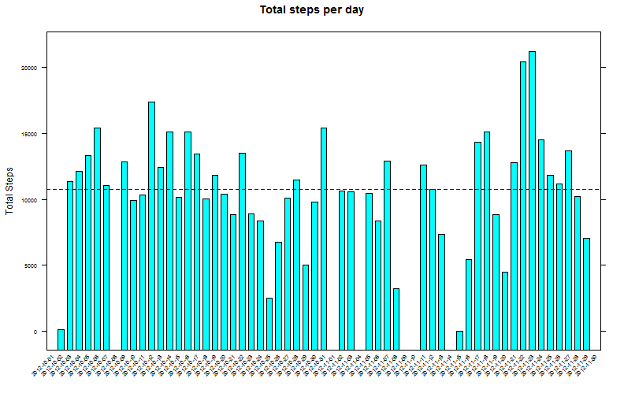
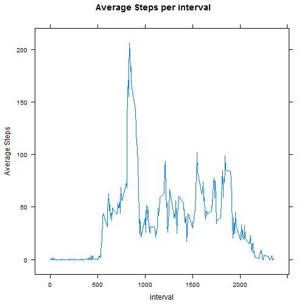
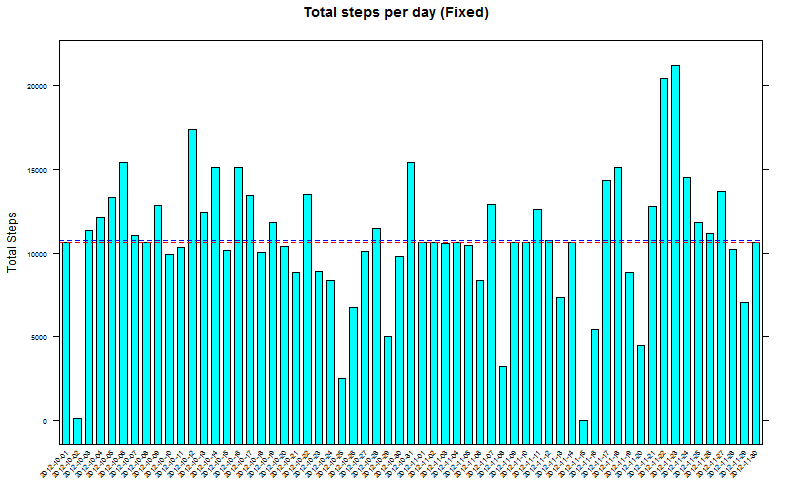
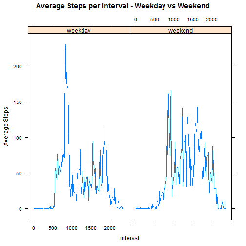

# Reproducible Research: Peer Assessment 1


## Loading and preprocessing the data

```r
library("sqldf")
```

```
## Loading required package: gsubfn
## Loading required package: proto
## Loading required package: RSQLite
## Loading required package: DBI
## Loading required package: RSQLite.extfuns
```

```r
library("lattice")
library("chron")

# unzip the data and read it in
unzip("activity.zip", exdir = ".")
data <- read.csv("activity.csv")

# Do all the data wranging now Start by Calculate the total steps by day
daySum <- sqldf("select date, SUM(steps) as steps from data group by date")
```

```
## Loading required package: tcltk
```

```r

# then Calculate the average steps by interval
intervalAvg <- sqldf("select interval, AVG(steps) as steps from data group by interval")
```


## What is mean total number of steps taken per day?

```r
barchart(steps ~ date, data = daySum, main = "Total steps per day", ylab = "Total Steps", 
    scales = list(x = list(rot = 45), cex = c(0.6, 1)), panel = function(x, 
        y, ...) {
        panel.barchart(x, y, ...)
        panel.abline(h = median(y, na.rm = TRUE), lty = 2, col = "red")
        panel.abline(h = mean(y, na.rm = TRUE), lty = 2, col = "blue")
    })
```

 

The mean total number of steps taken per day is 10766.  
The median total number of steps taken per day is 10765.  


## What is the average daily activity pattern?

```r
xyplot(steps ~ interval, data = intervalAvg, type = "l", main = "Average Steps per interval", 
    ylab = "Average Steps")
```

 

On average the maximum steps occurred during interval 835

## Imputing missing values
There are 2304 missing values in the original dataset.  


```r
# Merge the NA rows w/the interval averages and keep just the new step
# counts, then fix up the column names so they'll match
naFix <- merge(data[is.na(data$steps), ], intervalAvg, by = "interval")[, c("steps.y", 
    "date", "interval")]
names(naFix) <- c("steps", "date", "interval")

# Bind the non-NA rows w/the NA rows where the NA value is the mean for that
# interval
fixedData <- rbind(data[!is.na(data$steps), ], naFix)

# resort the data back to it's data/interval order
fixedData <- fixedData[order(fixedData$date, fixedData$interval), ]

# Get the Totals Steps by Day for the fixed dataset
fixedDaySum <- sqldf("select date, SUM(steps) as steps from fixedData group by date")
```


There are 0 missing values in the fixed dataset.  


```r
barchart(steps ~ date, data = fixedDaySum, main = "Total steps per day (Fixed)", 
    ylab = "Total Steps", scales = list(x = list(rot = 45), cex = c(0.6, 1)), 
    panel = function(x, y, ...) {
        panel.barchart(x, y, ...)
        panel.abline(h = median(y, na.rm = TRUE), lty = 2, col = "red")
        panel.abline(h = mean(y, na.rm = TRUE), lty = 2, col = "blue")
    })
```

 

The mean total number of steps taken per day is 10750.  
The median total number of steps taken per day is 10641.  


## Are there differences in activity patterns between weekdays and weekends?

```r
# We need to figure out weekday vs weekend, so convert the date column to
# POSIX and test
fixedData$typeOfDay = is.weekend(as.POSIXct(fixedData$date, format = "%Y-%m-%d"))
fixedData$typeOfDay[fixedData$typeOfDay == TRUE] <- "weekend"
fixedData$typeOfDay[fixedData$typeOfDay == FALSE] <- "weekday"
fixedIntervalAvg <- sqldf("select typeOfDay, interval, AVG(steps) as steps from fixedData group by typeOfDay, interval")

xyplot(steps ~ interval | typeOfDay, data = fixedIntervalAvg, type = "l", main = "Average Steps per interval - Weekday vs Weekend", 
    ylab = "Average Steps")
```

 


